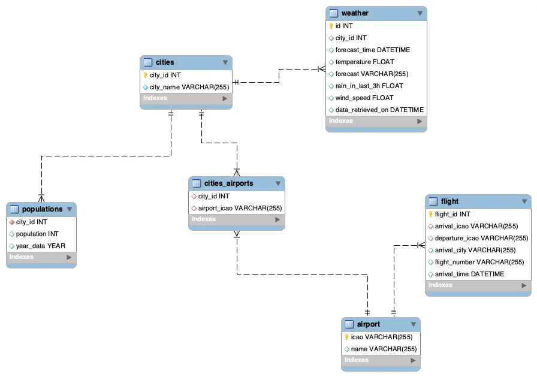

# Data_Pipelines_on_the_Cloud

the project is described in the following medium article
[Data Engineering Blog Post](https://medium.com/p/d98ede61ed12 "Data Engineering Blog Post")

# 🌦️ **Weather and Flight Data Integration**

This project integrates data from weather and flight APIs, stores the data in a MySQL database, and provides functionality to retrieve and store the data using Google Cloud Functions.

---

## 📋 **Table of Contents**  
- [**About the Project**](#about-the-project)  
- [**Features**](#features)  
- [**Installation**](#installation)  
- [**Usage**](#usage)  
- [**Contact**](#contact)  
- [**Acknowledgments**](#acknowledgments)  

---

## 💡 **About the Project**  

This project fetches weather and flight data from external APIs and stores it into a MySQL database. The project is implemented as a Google Cloud Function that inserts data from weather forecasts and flight details into the database at regular intervals.

---

## ✨ **Features**  
- **Weather Data:** Retrieves forecasted weather information for various cities and stores it in a database.
- **Flight Data:** Retrieves flight data based on airport ICAO codes and stores it in a MySQL database.
- **Cloud Function:** The data is fetched and inserted into the database via Google Cloud Functions.

---

## ⚙️ **Installation**  

### **Prerequisites**
- Python 3.8 or higher
- MySQL Database (with relevant schema and tables created)
- Google Cloud SDK (if deploying on Google Cloud)
- External API keys for Weather and Flight APIs

Install the required dependencies:
pip install -r requirements.txt

## **Setting Up Database**
Ensure that your MySQL database has the following tables created:

- cities (for city data)
- weather (to store weather forecast data)
- flight (to store flight data)
- airport (to store airport data)
Configure your MySQL connection in the connection() function with your MySQL credentials and database details.

## 🚀 **Usage**

Run the Cloud Function Locally
Make sure you have Google Cloud SDK installed and initialized.
Install functions-framework if you haven't already:
pip install functions-framework

Run the function locally:
functions-framework --target=insert

This will run the insert() function, which fetches weather data, flight data, and sends them to your database.

**API Configuration**
Weather API: Uses OpenWeatherMap to get forecast data for cities.
Flight API: Uses Aerodatabox to get flight departure details for airports.
Ensure you replace the API keys in the code with your own keys from OpenWeatherMap and Aerodatabox.

## 📞 **Contact**

Email: khanrupasadia@gmail.com
GitHub: Sadia-Khan-Rupa

## 🙌 **Acknowledgments**

OpenWeatherMap API: For weather forecast data.
Aerodatabox API: For flight data.
Google Cloud Functions: For serverless execution of data processing.
pandas: For data manipulation and storage.
